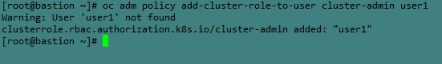

## Adding users to the cluster using htpasswd
1. Create the htpasswd file and add the users.
```
htpasswd -c -B -b htpassfile user1 password
htpasswd -B -b htpassfile user2 password
```
 - Here -c is creating new htpasswd file.
 - -B is encrypting the password in the file.
 - -b updating the file.

2. Create a secret. We need to use secret for adding these users to the openshift.

```
oc create secret generic localusers --from-file htpasswd=htpassfile -n openshift-config 
```

3. Assign role to the users.

```
 oc adm policy add-cluster-role-to-user cluster-admin user1
```


4. Update the oauth.

```
oc get oauth cluster -o yaml > oauth1.yaml
vi oauth1.yaml
oc replace -f oauth1.yaml
```


5. After updating the oauth check whether the authentiction operator started or not. Only after the pods started you can use the new users.(Login with users may take some time.)


