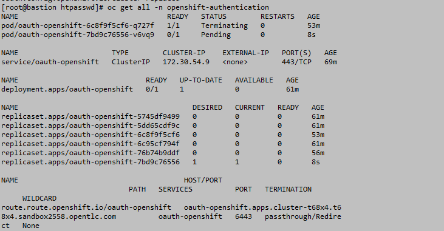
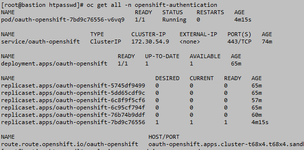
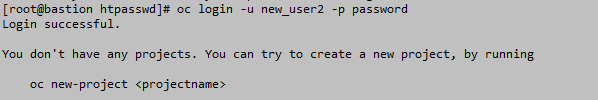
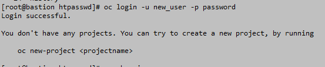
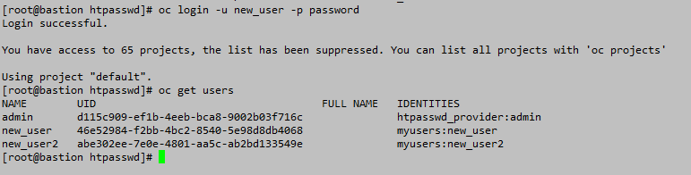
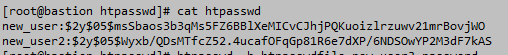

# RBAC
## 1. Creating user and assigning roles 

1. Create user with htpasswd and it file.
```
htpasswd -c -B -b htpasswdfile new_user password
htpasswd -B -b htpasswdfile new_user2 password
cat htpasswdfile
```

2. Create secret.

```
oc create secret generic mylocalusers --from-file htpasswd=htpasswdfile -n openshift-config
oc get secret -n openshift-config
```
3. Update the oauth. Change the oauth file and replce it.
```
oc get oauth cluster -o yaml > oauth.yaml
vi oauth.yaml  (add the required params)
oc replace -f oauth.yaml
```


Here I have update the oauth with highligted lines.One name is the secret which you have created and another give a name to the provider.

4. Now after the pods gets restarted you can login with the new user.

```
watch oc get pod -n openshift-authentication
```




5. Once the pods started, try login with the new users.




6. Assign roles to the users.
```
oc adm policy add-cluster-role-to-user cluster-admin new_user
```



## 2. Add new user with same secret.


```
 oc extract secret/mylocalusers -n openshift-config --to /root/htpasswd --confirm
 cat htpasswd
 htpasswd -b htpasswdfile new_user3 password
 cat htpasswdfile
 oc set data secret/mylocalusers --from-file=htpasswd=htpasswdfile -n openshift-config
 watch oc get all -n openshift-authentication
```


## 3. Change password for users.

1. Extract the file data from secret
2. Generate random user password & assign it to MANAGER_PASSWD variable.
3. Update password to the user
4. Update the secret.
5. Check for the pod to restart and try login with new password
6. Follow the below steps.

```
oc extract secrets/mylocalusers -n openshift-config --to /root/htpasswd/ --confirm
cat htpasswd
MANAGER_PASSWD="$(openssl rand -hex 15)"
htpasswd -b /root/htpasswd/htpasswd new_user3 ${MANAGER_PASSWD}
oc get secrets -n openshift-config
oc set data secret/mylocalusers --from-file htpasswd=htpasswd -n openshift-config
oc get all -n openshift-authentication
```

