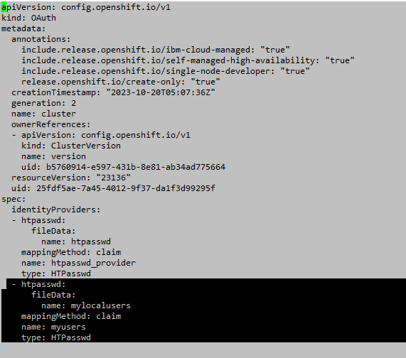
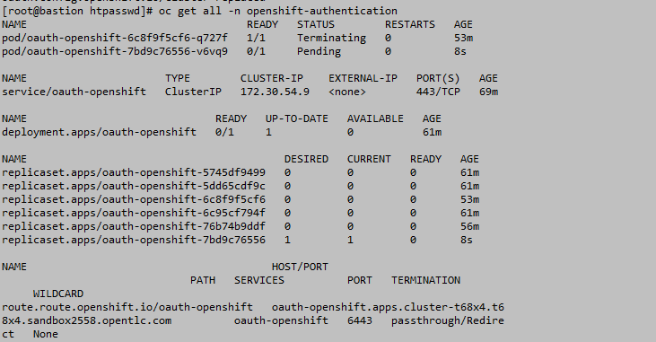
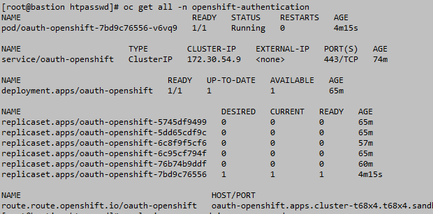
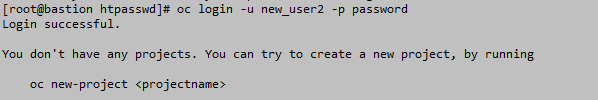
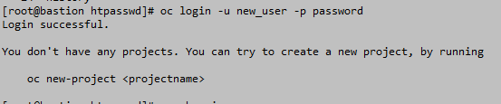

# RBAC
## Creating user and assigning roles 

1. Create user with htpasswd and it file.
```
htpasswd -c -B -b htpasswdfile new_user password
htpasswd -B -b htpasswdfile new_user2 password
cat htpasswdfile
```

2. Create secret.

```
oc create secret generic mylocalusers --from-file htpasswd=htpasswdfile -n openshift-config
oc get secret -n openshift-config
```
3. Update the oauth. Change the oauth file and replce it.
```
oc get oauth cluster -o yaml > oauth.yaml
vi oauth.yaml  (add the required params)
oc replace -f oauth.yaml
```



Here I have update the oauth with highligted lines.One name is the secret which you have created and another give a name to the provider.

4. Now after the pods gets restarted you can login with the new user.

```
watch oc get pod -n openshift-authentication
```




5. Once the pods started, try login with the new users.



