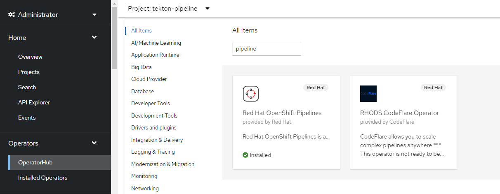

## Setup the Tekton-pipeline

1. Install the Tekton cli

```
curl -LO https://github.com/tektoncd/cli/releases/download/v0.32.0/tkn_0.32.0_Linux_x86_64.tar.gz
sudo tar xvzf tkn_0.32.0_Linux_x86_64.tar.gz -C /usr/local/bin/ tkn
```

2. Install OpenShift Pipelines from the OperatorHub in the web-console. Do not change any settings, intall as default.


3. Create a Project which you can use for pipelines.And check the service account which get created along with the pipeline that has permissions to pull and push the images.

```
oc new-project tekton-pipeline
oc get serviceaccount pipeline
```

4. Create pipeline tasks which you will be using in the pipeline.

[task1](https://raw.githubusercontent.com/openshift/pipelines-tutorial/master/01_pipeline/01_apply_manifest_task.yaml)
[task2](https://raw.githubusercontent.com/openshift/pipelines-tutorial/master/01_pipeline/02_update_deployment_task.yaml)
### task 1 
```
apiVersion: tekton.dev/v1beta1
kind: Task
metadata:
  name: apply-manifests
spec:
  workspaces:
  - name: source
  params:
    - name: manifest_dir
      description: The directory in source that contains yaml manifests
      type: string
      default: "k8s"
  steps:
    - name: apply
      image: image-registry.openshift-image-registry.svc:5000/openshift/cli:latest
      workingDir: /workspace/source
      command: ["/bin/bash", "-c"]
      args:
        - |-
          echo Applying manifests in $(inputs.params.manifest_dir) directory
          oc apply -f $(inputs.params.manifest_dir)
          echo -----------------------------------
```

### task2
```
apiVersion: tekton.dev/v1beta1
kind: Task
metadata:
  name: update-deployment
spec:
  params:
    - name: deployment
      description: The name of the deployment patch the image
      type: string
    - name: IMAGE
      description: Location of image to be patched with
      type: string
  steps:
    - name: patch
      image: image-registry.openshift-image-registry.svc:5000/openshift/cli:latest
      command: ["/bin/bash", "-c"]
      args:
        - |-
          oc patch deployment $(inputs.params.deployment) --patch='{"spec":{"template":{"spec":{
            "containers":[{
              "name": "$(inputs.params.deployment)",
              "image":"$(inputs.params.IMAGE)"
            }]
          }}}}'

          # issue: https://issues.redhat.com/browse/SRVKP-2387
          # images are deployed with tag. on rebuild of the image tags are not updated, hence redeploy is not happening
          # as a workaround update a label in template, which triggers redeploy pods
          # target label: "spec.template.metadata.labels.patched_at"
          # NOTE: this workaround works only if the pod spec has imagePullPolicy: Always
          patched_at_timestamp=`date +%s`
          oc patch deployment $(inputs.params.deployment) --patch='{"spec":{"template":{"metadata":{
            "labels":{
              "patched_at": '\"$patched_at_timestamp\"'
            }
          }}}}'

```

Create both the tasks.
```
oc apply -f task1.yaml
oc apply -f task2.yaml
tkn task ls
```
resulting in output similar to:
```
$ tkn task ls
NAME                AGE
apply-manifests     10 seconds ago
update-deployment   4 seconds ago
``` 

5. Create the pipeline.
This pipeline will contain the tasks which will executed by the pipeline.

[pipeline](https://raw.githubusercontent.com/openshift/pipelines-tutorial/master/01_pipeline/04_pipeline.yaml)

```
apiVersion: tekton.dev/v1beta1
kind: Pipeline
metadata:
  name: build-and-deploy
spec:
  workspaces:
  - name: shared-workspace
  params:
  - name: deployment-name
    type: string
    description: name of the deployment to be patched
  - name: git-url
    type: string
    description: url of the git repo for the code of deployment
  - name: git-revision
    type: string
    description: revision to be used from repo of the code for deployment
    default: "master"
  - name: IMAGE
    type: string
    description: image to be build from the code
  tasks:
  - name: fetch-repository
    taskRef:
      name: git-clone
      kind: ClusterTask
    workspaces:
    - name: output
      workspace: shared-workspace
    params:
    - name: url
      value: $(params.git-url)
    - name: subdirectory
      value: ""
    - name: deleteExisting
      value: "true"
    - name: revision
      value: $(params.git-revision)
  - name: build-image
    taskRef:
      name: buildah
      kind: ClusterTask
    params:
    - name: TLSVERIFY
      value: "false"
    - name: IMAGE
      value: $(params.IMAGE)
    workspaces:
    - name: source
      workspace: shared-workspace
    runAfter:
    - fetch-repository
  - name: apply-manifests
    taskRef:
      name: apply-manifests
    workspaces:
    - name: source
      workspace: shared-workspace
    runAfter:
    - build-image
  - name: update-deployment
    taskRef:
      name: update-deployment
    workspaces:
    - name: source
      workspace: shared-workspace
    params:
    - name: deployment
      value: $(params.deployment-name)
    - name: IMAGE
      value: $(params.IMAGE)
    runAfter:
    - apply-manifests
```
Create the pipeline
```
oc create -f pipeline.yaml
```

6. Create a pvc which you will use for running the application.

- 